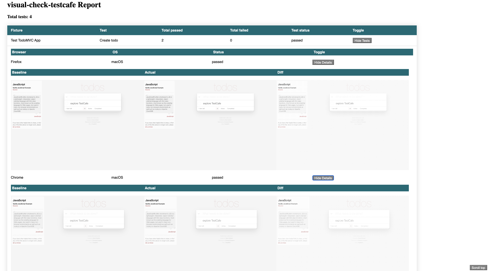

# visual-check-testcafe

Testcafe plugin for testing visual regression backed by resemblejs image compare

## Features

- Fully integrated in test run
- Concurrency
- Multi-browsers
- Reporting

## Installation

```bash
npm install visual-compare-testcafe --save-dev
```

## How to use

You can write a TestCafe test with automated visual testing like this.

```js
import { visualCheck } from 'visual-check-testcafe';
import { Selector } from 'testcafe';

fixture `TestCafe tests with Visual compare`
    .page `http://example.com`;

test('Automated visual testing', async t => {
  // invoke with selector to validate part of a page
  await visualCheck(t, 'loginForm', Selector('form'));
  // invoke without selector to validate whole page
  await visualCheck(t, 'loginPage');
});

```

### Reporting

<p align="center">
  
</p>


### Options
```
visualCheck(t, label?, options?)
```

- `label|options.label` &mdash; Custom name for the taken snapshot
- `options.timeout` &mdash; Waiting time before taking snapshots
- `options.selector` &mdash; String, or `Selector()` to match on the DOM
- `options.maxDiffOffset`&mdash; Default is 0.1 

### Setup 
Each time you run tests with --setup-baseline it'll take the base screenshots.
It will report during test in the following way:

```bash
visual-check-testcafe: Baseline {path} created
```

During a test run it can occur a baseline is not there. If you haven't provided 
 the --setup-baseline your test will fail with the following message:

```bash
AssertionError: visual-check-testcafe: no baseline present, storing baseline for next run: expected 'no baseline' to be falsy
      
      + expected - actual
      
      -'no baseline'
      +undefined
```


